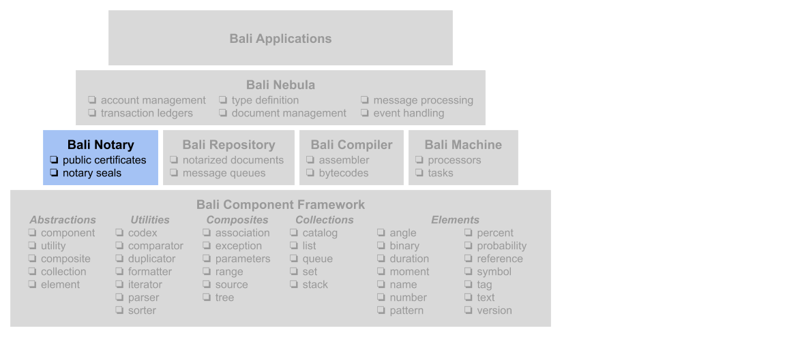

### Bali Nebula™ HSM Proxy
This project defines a JavaScript implementation of the Bali Nebula™ security module interface that acts as a proxy to a BLE based hardware security module. This proxy can be plugged into the digital notary classes for the [_Bali Nebula™_](https://github.com/craterdog-bali/bali-project-documentation/wiki).



_**WARNING**_
_This project is still in its early stages and the classes and interfaces to the classes are likely to change._

### Quick Links
For more information on this project click on the following links:
 * [wiki](https://github.com/craterdog-bali/js-bali-hsm-proxy/wiki)
 * [node package](https://www.npmjs.com/package/bali-hsm-proxy)
 * [release notes](https://github.com/craterdog-bali/js-bali-hsm-proxy/wiki/release-notes)
 * [project documentation](https://github.com/craterdog-bali/bali-project-documentation/wiki)

### Getting Started
To install this NodeJS package, execute the following command:
```
npm install bali-hsm-proxy
```
Then add the following line to your NodeJS modules:
```
const notary = require('bali-hsm-proxy');
```

Check out the example code [here](https://github.com/craterdog-bali/js-bali-hsm-proxy/wiki/code-examples).

### Contributing
Project contributors are always welcome. Create a [fork](https://github.com/craterdog-bali/js-bali-hsm-proxy) of the project and add cool new things to the framework. When you are ready to contribute the changes create a subsequent ["pull request"](https://help.github.com/articles/about-pull-requests/). Any questions and comments can be sent to craterdog@gmail.com.
